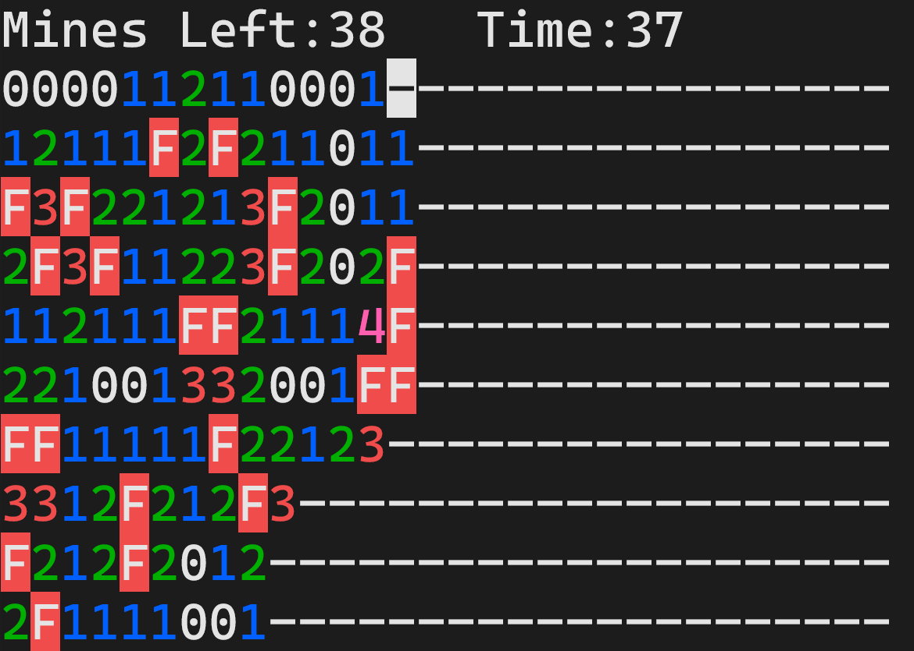

# Termines

Minesweeper tui app



## How to run

Binaries are linked in github releases, or download the code and use:

```bash
go run .
```

## Gameplay

Move with vim motions `hjkl` or arrows `←↓↑→`.

There are also Big Moves, using `HJKL` or `s (←↓↑→)`, which will basically move you to the next square of different kind.

Open or Chord with `d`, Flag toggle with `f`.

use `b` when game is over to go back to menu or `r` to restart the game with same field size and mine number.

When field is too large to fit on screen, it will automatically scroll when moving.
You can also scroll on your own with `yuio` and `YUIO` (vim motions one row up).

## Saved Games and Replay

Games are automatically saved, you can find them through filters and delete them.

You can go through replay of a these games and see every step of the game. 
Also there is real-time autoplay that you can toggle by pressing `p` at any step in replay.

## Settings

Theme can be changed to Default, Dark, Light and Mono.
Note that Mono is like playing on a hard mode because you can't tell numbers apart.

Max scrolloff can be changed.
When max scrolloff is higher than 0, because cursor behaves differently near the edges, you will always know if you are near the edge of the field without manually having to check.

## Keymaps

### Menu

|Key|Action|
|-----|-------|
|`q` or `Esc` or `Ctrl+c`|Quit|
|`b`|Back to previous stage in menu|
|`k` or `↑`|Move up through options|
|`j` or `↓`|Move down through options|
|`h` or `←`|Move left through options|
|`l` or `→`|Move right through options|
|`0-9`|Type numbers|
|`Backspace`|Delete numbers|
|`Enter` or `Tab` or `Space` or `d`|Confirm|
|`m m`|Remove saved game if one is selected|

### Play

|Key|Action|
|-----|-------|
|`Ctrl+c`|Quit|
|`q q`|Go back to menu|
|`k` or `↑`|Move up once|
|`j` or `↓`|Move down once|
|`h` or `←`|Move left once|
|`l` or `→`|Move right once|
|`K` or `s ↑`|Move up big|
|`J` or `s ↓`|Move down big|
|`H` or `s ←`|Move left big|
|`L` or `s →`|Move right big|
|`d` or `D`|Open|
|`f` or `F`|Flag|
|`i`|Scroll up once|
|`u`|Scroll down once|
|`y`|Scroll left once|
|`o`|Scroll right once|
|`I`|Scroll up to cursor|
|`U`|Scroll down to cursor|
|`Y`|Scroll left to cursor|
|`O`|Scroll right to cursor|
|`?`|Switch between current and starting stats|

### Replay

|Key|Action|
|-----|-------|
|`q` or `Esc` or `Ctrl+c`|Quit|
|`b`|Go back to menu|
|`m m`|Remove current replay's saved game|
|`r`|Create play with same width, height and mine count as current replay|
|`p`|Toggle real-time autoplay of current replay|
|`h` or `←`|Move to previous step of a replay|
|`l` or `→`|Move to next step of a replay|
|`j` or `↓`|Move to the start of a replay|
|`k` or `↑`|Move to the end of a replay|
|`i`|Scroll up once|
|`u`|Scroll down once|
|`y`|Scroll left once|
|`o`|Scroll right once|
|`I`|Scroll up to cursor|
|`U`|Scroll down to cursor|
|`Y`|Scroll left to cursor|
|`O`|Scroll right to cursor|
